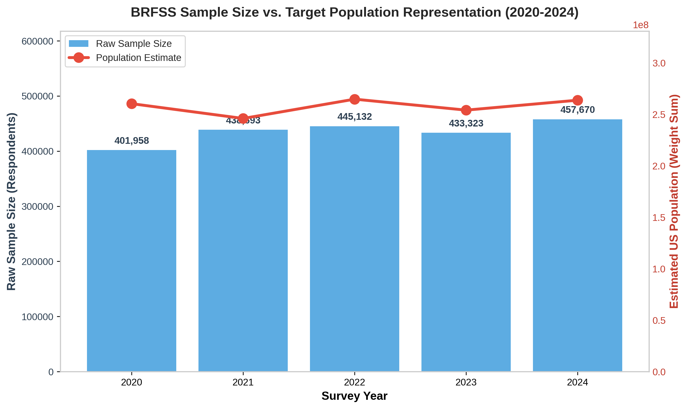
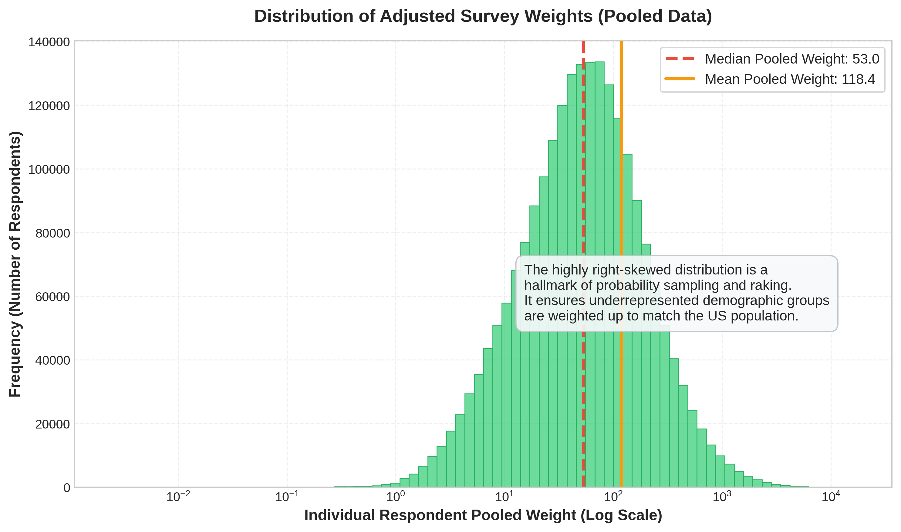

# Data source, cleaning, and weighting overview

## Sample sizes and weighted population per year

| Year | Raw sample | Starting columns | Cleaning notes | Weight sum (population) |
|------|-----------:|-----------------:|----------------|------------------------:|
| 2020 | 401,958 | 279 | Standardized CDC sentinel missing codes | 260,408,470 |
| 2021 | 438,693 | 303 | Income grouping changed (8 -> 11 levels) | 246,041,640 |
| 2022 | 445,132 | 328 | Several `_` calculated variables renamed | 264,789,594 |
| 2023 | 433,323 | 350 | Cell phone variables restructured | 254,139,829 |
| 2024 | 457,670 | 301 | Some rotated modules removed | 263,783,390 |
| Pooled (2020-2024) | 2,176,776 | 165 (shared) | `_LLCPWT_POOLED = _LLCPWT / 5` | 257,832,585 (annual avg) |

The weight sum approximates the U.S. adult population each year. After pooling, dividing the weights by 5 keeps the total at roughly one year's worth of population.

## Visualizations

### Sample size vs. target population

Bars are the raw response counts each year, and the line is the population estimate the weights represent. The sample size moves around with state-level completion rates, but the raked weights keep the population scale roughly constant.

### Survey weight distribution

BRFSS uses iterative proportional fitting (raking) to construct weights. The distribution is heavily right-skewed (shown on a log scale) because respondents from underrepresented groups receive larger weights to balance the sample.

